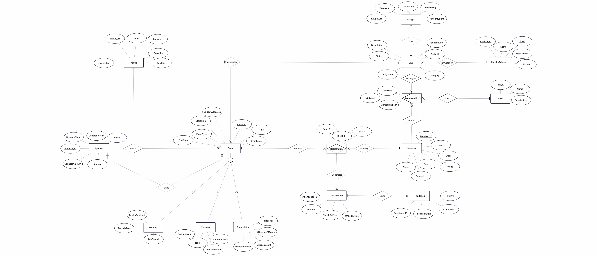
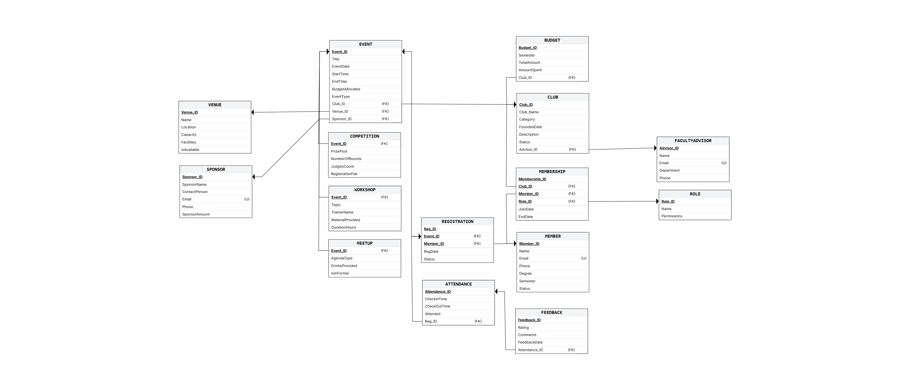

# 🏛️ Charter
### Campus Club & Event Management Suite


> *A charter is the founding document of any official organization.*  
> Charter is a database-driven platform for managing university clubs,  
> events, memberships, budgets, and analytics — built with Oracle SQL  
> and Oracle APEX.

---

## 📌 Problem Statement

University clubs struggle to manage members, events, registrations,
attendance, budgets, and feedback across multiple departments.
Charter provides a centralized analytical system for administrators,
club presidents, faculty advisors, and members to manage and track
all club-related operations in one place.

---

## ✨ Features

- **Role Based Access Control** — 4 roles with different access levels
- **Club Management** — create and manage clubs with faculty advisors
- **Event Management** — workshops, competitions and meetups with subclass details
- **Member Management** — track degrees, semesters and status
- **Membership Management** — track member roles per club
- **Registration & Attendance** — full event attendance pipeline
- **Feedback System** — verified attendee only feedback
- **Budget Tracking** — per club per semester with auto computed remaining
- **Sponsor Management** — track event sponsorships
- **Venue Management** — track venues with availability control
- **Analytics Dashboard** — 8 analytical charts and reports
- **Interactive Dashboard** — 4 live stat cards with real time data
- **Custom Authentication** — role based login with Charter user accounts

---

## 🗂️ Project Structure
Charter/
│
├── README.md
│
├── docs/
│   ├── EERD.png
│   └── Relational_Model.png
│
├── sql/
│   ├── queries/
│   │   ├── 01_most_attended_events.sql
│   │   ├── 02_top_rated_events.sql
│   │   ├── 03_club_budget_utilization.sql
│   │   ├── 04_most_active_members.sql
│   │   ├── 05_sponsor_contribution_ranking.sql
│   │   ├── 06_monthly_event_count.sql
│   │   ├── 07_venue_utilization.sql
│   │   └── 08_member_retention.sql
│   │
│   ├── 01_create_tables.sql
│   ├── 02_insert_data.sql
│   └── 03_auth_setup.sql
│
└── apex/
    └── charter_app.sql

---

## 🗃️ Database Design

### Entity Relationship Diagram



### Relational Model



---

## 📊 Schema Overview

Charter is built on **16 tables** covering the full lifecycle of
campus club management:

| # | Table | Role |
|---|---|---|
| 1 | FacultyAdvisor | Manages club oversight |
| 2 | Club | Core club entity |
| 3 | Member | Registered students |
| 4 | Role | Club roles and permissions |
| 5 | Membership | Resolves Member ↔ Club M:N |
| 6 | Venue | Event locations with availability |
| 7 | Sponsor | Event sponsors |
| 8 | Event | Superclass — core of system |
| 9 | Workshop | Subclass of Event |
| 10 | Competition | Subclass of Event |
| 11 | Meetup | Subclass of Event |
| 12 | Registration | Resolves Member ↔ Event M:N |
| 13 | Attendance | Tracks event attendance |
| 14 | Budget | Per club per semester |
| 15 | Feedback | Verified attendee reviews |
| 16 | Charter_Users | Application user accounts |

### Key Design Decisions

- **Total Disjoint Specialization** on Event — every event must be
  a Workshop, Competition or Meetup, like an abstract class in Java
- **Membership** as associative entity resolving M:N between
  Member and Club
- **Role** linked to Membership not Club — a member's role is
  club specific, not global
- **Feedback** linked to Attendance not Member — only verified
  attendees who marked Attended YES can give feedback
- **Virtual Column** for Budget Remaining —
  auto computed as TotalAmount minus AmountSpent
- **CHECK Constraints** on all controlled fields —
  Status, EventType, Rating, Attended, IsAvailable etc
- **Venue Availability Filter** — only available venues appear
  in Event form dropdown
- **Subclass Filtered Dropdowns** — Workshop/Competition/Meetup
  pages only show events of their respective type

---

## 🔐 Role Based Access Control

| Role | Access |
|---|---|
| **Admin** | Full access — all pages, all CRUD |
| **President** | Events, Workshops, Competitions, Meetups, Registration, Attendance, Memberships |
| **Member** | Registration, Feedback |
| **Advisor** | Analytics, Budget — read only |

### Custom Authentication

Charter uses a custom authentication scheme backed by the
CHARTER_USERS table — not Oracle APEX default accounts.
Login credentials are verified against the database and
roles are assigned via session state after authentication.

---

## 📈 Analytical Queries

| # | Query | Insight |
|---|---|---|
| 1 | Most Attended Events | Events ranked by verified attendance |
| 2 | Top Rated Events | Events ranked by average feedback rating |
| 3 | Club Budget Utilization | Spending percentage per club |
| 4 | Most Active Members | Members ranked by registrations |
| 5 | Sponsor Contribution Ranking | Sponsors ranked by amount |
| 6 | Monthly Event Count | Event trend over time |
| 7 | Venue Utilization | Venues ranked by events hosted |
| 8 | Member Retention | Membership growth over time |

---

## 🖥️ Oracle APEX Pages

| Page | Type | Access |
|---|---|---|
| Login | Custom Authentication | Public |
| Dashboard | Stat Cards + 3 Charts | All roles |
| Clubs | Interactive Report + Form | Admin |
| Members | Interactive Report + Form | Admin |
| Memberships | Interactive Report + Form | Admin, President |
| Faculty Advisors | Interactive Report + Form | Admin |
| Events | Interactive Report + Form | Admin, President |
| Workshops | Interactive Report + Form | Admin, President |
| Competitions | Interactive Report + Form | Admin, President |
| Meetups | Interactive Report + Form | Admin, President |
| Budget | Interactive Report + Form | Admin, Advisor |
| Sponsors | Interactive Report + Form | Admin |
| Venues | Interactive Report + Form | Admin |
| Registration | Interactive Report + Form | Admin, President, Member |
| Attendance | Interactive Report + Form | Admin, President |
| Feedback | Interactive Report + Form | Admin, Member |
| Analytics | 8 Analytical Charts | Admin, Advisor |

---

## 🎨 Design System

| Element | Value |
|---|---|
| Primary Color | `#1B2A4A` Deep Navy |
| Accent Color | `#F0A500` Gold |
| Background | `#F8F9FA` Off White |
| Card Background | `#FFFFFF` Pure White |
| Text | `#2D2D2D` Dark Charcoal |
| Theme | Oracle APEX Universal Theme |
| Icons | Font Awesome |
| Chart Colors | Navy + Gold diagonal alternating |

---

## 🚀 Setup Instructions

### Prerequisites
- Oracle Database
- Oracle APEX Workspace

### Step 1 — Create Tables
```sql
-- Run in SQL Workshop → SQL Scripts
01_create_tables.sql
```

### Step 2 — Insert Sample Data
```sql
-- Run in SQL Workshop → SQL Scripts
02_insert_data.sql
```

### Step 3 — Setup Authentication
```sql
-- Run in SQL Workshop → SQL Scripts
03_auth_setup.sql
```

### Step 4 — Import APEX Application
App Builder → Import → charter_app.sql

### Step 5 — Login Credentials

| Username | Password | Role |
|---|---|---|
| admin | admin123 | Admin |
| president | president123 | President |
| member | member123 | Member |
| advisor | advisor123 | Advisor |

---

## 📚 Course Information

- **Course** — Database Systems (DBS)
- **Semester** — [Your Semester]
- **Institution** — [Your University]
- **Instructor** — [Sir's Name]

---

## 👥 Team

| Name | Role |
|---|---|
| [Name 1] | Schema Design, Oracle DDL, Analytical Queries, APEX Development |
| [Name 2] | EERD, Relational Model |
| [Name 3] — | Supporting Development |

---

## 📄 License

This project was developed as a semester project for academic
purposes. All rights reserved.

---

*Built with 🏛️ by the Charter Team*